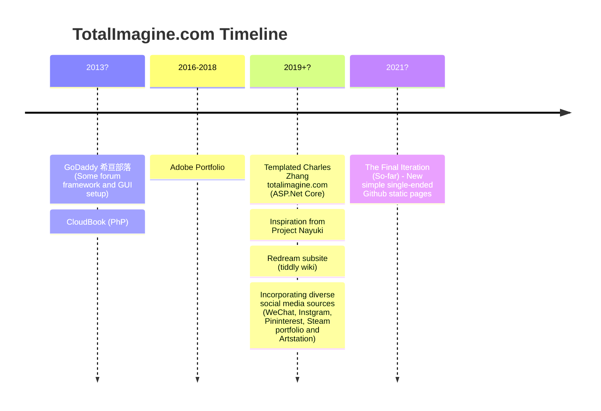

# A Refurbished Website and Public Content Posting Scheme (WIP)

Original Draft Date: 2022-08-20  
Original Publish Date: 2022-08-20  
Last Update Date: 2023-11-28

> From this moment on, my ink will only be written on things that's worthwhile - arts and creations, and on things that's out of necessity: communication. 

Posting on social media is dangerous and harmful. It hurts not just the yongsters through comparing and peer pressure, but also hurts the authors because of all the delicate feelings - even [Tom Holland quits social media due to mental health concerns](https://www.cbsnews.com/news/tom-holland-social-media-mental-health-spider-man/). I will not argue how bad social media might have been, but in this post I will briefly share from a technical point of view how I ended up with building the website as you see now.

The direct inpsiration for all of this, ironically, is an instant inspirational.

Future candidate of embeddable components with cloud hosting services:

* Generic static hosting: AWS (Lambda, E3)
* Free solution hosting: PlayCanvas, Streamlit
* Social meida content-hoster with content-ownership: Itch.IO, Gumroad, ArtStation, YouTube
* Rendering components: Plotly, Babylon JS, Processing JS
* Github Pages Enhancements: Mermaid, Discussion and Comments.

## Actual Demands

Originally I made website for fun, during very early times I thought of making a tech blog for money. Latter it's just my "face" and a representation of my work. Throughout I always wanted to build some space. Nowadays it serves mostly as a reference function for myself. One always need to be careful putting only very very original stuff on it, and limit its reference functions to public-facing aspects (e.g. Crate Universe is a BAD idea) - this is achieved by limiting its functionalities to linking and redirections, and avoid dynamically built solutions and custom content hosting. Focus on texts. And it will look more like a blog. Anyway, attracting audience or be useful to others is not our goal.

Historically, it served the following purposes:

1. Portfolio
2. Central showcase broadcasting network
3. Personal reference (public facing), re-directors, shorthands
4. Buildable, programmable, connectable: deal with issues like Bookmark Ninja

Maintability and ease of use are the greatest; Simplicity is key; Infrastructure-based but light. ASP.Net Core is too bad. Static is key.

## Building Process (Github-Pages Centric)

1. Raw data: MD and raw HTML authored directly for some category pages. The raw data can be saved in any other places of interest.
2. Build HTML from MD using Visual Studio Code when needed.

Why not use a static webpage builder?

## Some Ground Rules

1. Articles are dated and updated; So there is minimal noise.