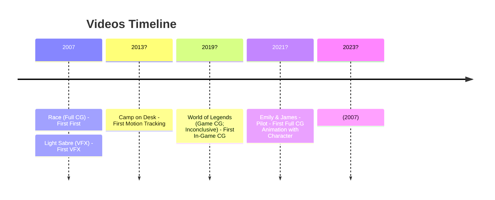

# My CG Path (Tentative Title) (WIP/Draft)

Initial Draft: 2023-11-26  
Status: Draft  
Tags: Reference, Record, CG

Short description plus glimpse, mostly videos.

## Renders

(Don't show iamges)

## Videos

### Race (2007)

|Resource|Link|
|-|-|

### Light Sabre Video (2008?)

Status: First Complete Roto-VFX

### Camp on Desk (2013?)

Status: First Camera VFX Motion Tracking

### Emily & James - Pilot (2021)

Status: First Full CGI Animation with Character

<!-- 2007 (2023) -->

## Shorts

### World oF Legend (2019?)

|Resource|Link|
|-|-|

