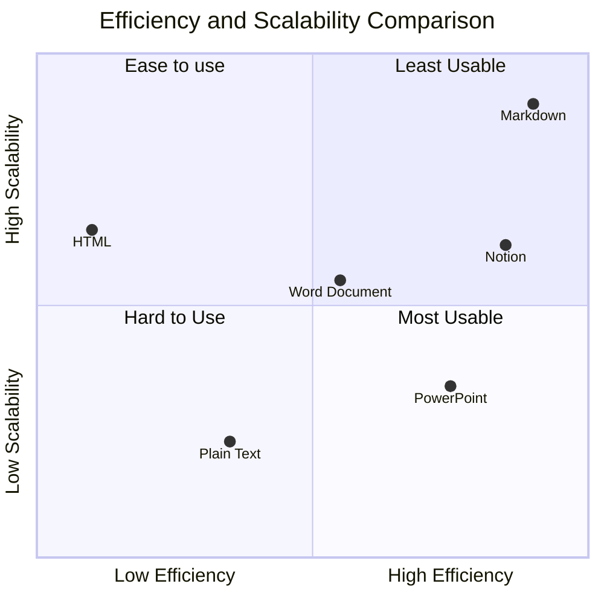

# Cool Markdown

Markdown is Cool

Original Draft: 2023-10-04  
Publication: N/A  
Source: [Github](https://github.com/TotalImagine-com/TotalImagine.com/blob/main/Resources/CoolMarkdown.md)

<svg version="1.1" id="L1" xmlns="http://www.w3.org/2000/svg" xmlns:xlink="http://www.w3.org/1999/xlink" x="0px" y="0px" viewBox="0 0 100 100" enable-background="new 0 0 100 100" xml:space="preserve" width="50">
    <circle fill="none" stroke="#000" stroke-width="6" stroke-miterlimit="15" stroke-dasharray="14.2472,14.2472" cx="50" cy="50" r="47" >
      <animateTransform 
         attributeName="transform" 
         attributeType="XML" 
         type="rotate"
         dur="5s" 
         from="0 50 50"
         to="360 50 50" 
         repeatCount="indefinite" />
  </circle>
  <circle fill="none" stroke="#000" stroke-width="1" stroke-miterlimit="10" stroke-dasharray="10,10" cx="50" cy="50" r="39">
      <animateTransform 
         attributeName="transform" 
         attributeType="XML" 
         type="rotate"
         dur="5s" 
         from="0 50 50"
         to="-360 50 50" 
         repeatCount="indefinite" />
  </circle>
  <g fill="#fff">
  <rect x="30" y="35" width="5" height="30" fill="black">
    <animateTransform 
       attributeName="transform" 
       dur="1s" 
       type="translate" 
       values="0 5 ; 0 -5; 0 5" 
       repeatCount="indefinite" 
       begin="0.1"/>
  </rect>
  <rect x="40" y="35" width="5" height="30" fill="black">
    <animateTransform 
       attributeName="transform" 
       dur="1s" 
       type="translate" 
       values="0 5 ; 0 -5; 0 5" 
       repeatCount="indefinite" 
       begin="0.2"/>
  </rect>
  <rect x="50" y="35" width="5" height="30" fill="black">
    <animateTransform 
       attributeName="transform" 
       dur="1s" 
       type="translate" 
       values="0 5 ; 0 -5; 0 5" 
       repeatCount="indefinite" 
       begin="0.3"/>
  </rect>
  <rect x="60" y="35" width="5" height="30" fill="black">
    <animateTransform 
       attributeName="transform" 
       dur="1s" 
       type="translate" 
       values="0 5 ; 0 -5; 0 5"  
       repeatCount="indefinite" 
       begin="0.4"/>
  </rect>
  <rect x="70" y="35" width="5" height="30" fill="black">
    <animateTransform 
       attributeName="transform" 
       dur="1s" 
       type="translate" 
       values="0 5 ; 0 -5; 0 5" 
       repeatCount="indefinite" 
       begin="0.5"/>
  </rect>
  </g>
</svg>

This demo serves as an "attraction" to persuade people they should use Markdown instead of Microsoft Doc for note taking. It's rendered using Github Pages (Jekyll) with [Mermaid](https://github.com/TotalImagine-com/TotalImagine.com/commit/035a2731e5d3c12e21c03e8beb0bbde0391d9715) for Markdown. The additional support for Javascript (mostly for [Neko](https://webneko.net)) is optional and only for fun.

It uses a few notable features:

1. Github flavoured markdown
2. Mermaid diagrams
3. SVG (for animation and shapes)
4. Some HTML and CSS for additional styling
5. Use LaTex for equation rendering

TODO:

- [x] Basic demo setup
- [ ] Fix typos of texts
- [ ] Add more descriptive examples and show syntax of Markdown

## Why You Should Use Markdown

1. It supports **bold**, *italic*, ***bold italic***, and ~~strikethrough~~.
2. You can edit it in Visual Studio Code, with syntax highlight.
3. You can draw diagrams using mermaid.
4. You can use pandoc to output Markdown to various formats (or just use VS Code): HTML, Doc, PDF.
5. You can write LaTeX formulas: $E=mc^2$.
6. You can have tables and use emojis👍 and insert images.
7. Easy to parse, fully programmable.

|Markdown|Word Doc|Text|
|-|-|-|
|Light weight|Binary|Light Weight|
|Plain Text + HTML, CSS, SVG|XML and Indecipherable|Plain Text|

## Credits

* [Snowflake Animation](https://codepen.io/codeconvey/pen/xRzQay)
* [Gradient Text Animation](https://codepen.io/amit_merchant/pen/yLxgMGz)
* [SVG Animations](https://codepen.io/nikhil8krishnan/pen/rVoXJa)

## References
* [Github Flavour Markdown](https://gist.github.com/stevenyap/7038119)
* [Full Doc](https://docs.github.com/en/get-started/writing-on-github/getting-started-with-writing-and-formatting-on-github/basic-writing-and-formatting-syntax)
* [Methodox's Intro to GitHub Flavoured Markdown](https://wiki.methodox.io/en/KnowledgeBase/Markdown)

<!-- Render Elements -->

    

        ❅
    

    

        ❅
    

    

        ❆
    

    

        ❄
    

    

        ❅
    

    

        ❆
    

    

        ❄
    

    

        ❅
    

    

        ❆
    

    

        ❄
    

<h1 id=nl><a 
href="https://webneko.net">Neko</a></h1>
