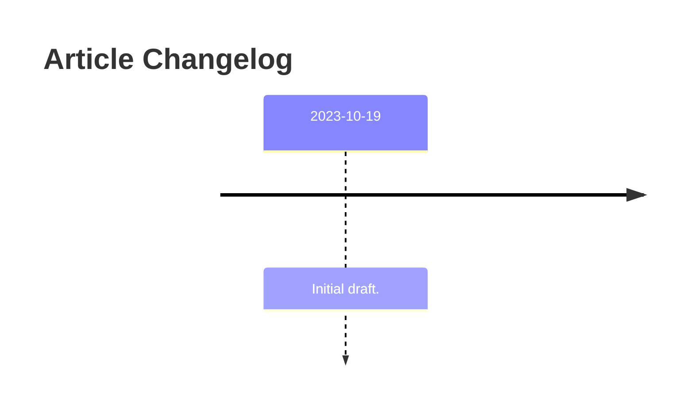

# Fluent Synth

Initial Article Conception: 2023-10-17  
Initial Draft (of Article): 2023-10-19  
Last Update: 2023-10-19  
Github: https://github.com/chaojian-zhang/FluentSynth  
Itch.IO: https://charles-zhang.itch.io/fluent-synth  

The design background and technical notes of Fluent Synth are documented well on the [Github repo](https://github.com/chaojian-zhang/FluentSynth). The motivation for this article is that Ray mentioned he's interested in the design or brainstorming phase - those are hinted by the choice of framework and APIs in the source code but it's helpful for general audience to have a high-level summary.

(A more useful presentation involves having Fluent Synth available on the web, which is on the way)

Fluent Synth v0.1-v0.2 is a program done in three days but there are quite extensive background to it. Before I could program in C# "fluently" there was a long way concerning music theory and sound (and voice) synthesization that ultimately leads up to this point.

(PENDING MORE)

