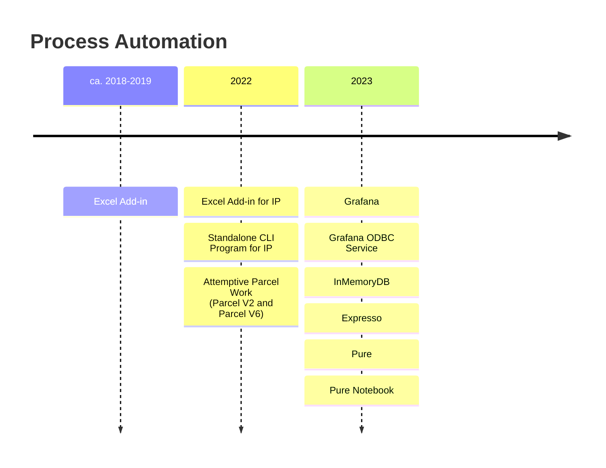

# OTPP 2023

Tags: Reflection, @Year-End-Summary

Initial Draft: 2023-10-19

I once said when working for a company there are three types of skills that we learn: 1) Those we already knew well - this is passive practice; 2) Those that is related to the business process of the company and is useless nowhere else (by and large); 3) And those that we totally didn't expect. The last point is kind of like doing art - when you begins you really don't really know where exactly you will end, and you probably SHOULDN'T have a super strong goal in the first place.

In terms of process automation and optimization, throughout the majority of 2023 a few surprising outcomes emerge involving (in production) the use of PowerShell and the development and use of Pure. More can be said on this topic.

Life-wise speaking, after the down down downhill in 2022, life starts to come back together again (mostly after the bonus in April?). It's still hopeless for us to get plenty of money and time for Project Nine - but everything is brighter now, and despite snail-speed progress, we are making advancement in terms of Project Nine. It's also great to have a (new) friend.